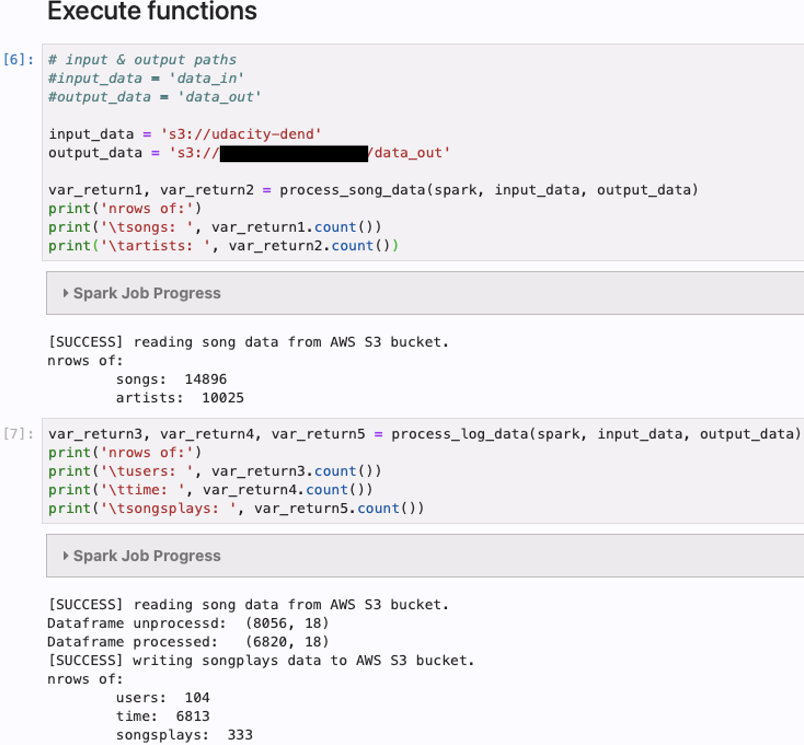
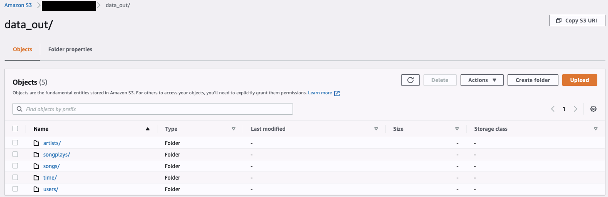

# sparkify_spark_aws
Udacity Data Engineering Nano Degree - Project 4
> copy on [github](https://github.com/dsmatthew/sparkify_spark_aws)

Within this project the startup "Sparkify" would like to build a database to analyze their logged user data. They collect data about songs played (streamed) by their users. This analysis should prepare to understand what their customers are listening to.

The raw data is provided within multiple json files differentiated by song data (songs, artists, albums etc.) and user action log data (users listening to music, navigating within the streaming application etc.). The objective is to create a star schema in order to have a database prepared and ready for further analytics.

### Table of Contents

1. [Installation](#installation)
2. [Project Motivation](#motivation)
3. [File Descriptions](#files)
4. [Results](#results)
5. [Licensing, Authors, and Acknowledgements](#licensing)

## Installation 

This project was developed w/ Python 3.x on an AWS EMR (spark) cluster.
Please remark the prerequirements below.

Used libraries:
* pyspark

HINT FOR USAGE:
0. Prepare your AWS account (IAM role including access to S3 buckets (roles: 'AdministratorAccess' and 'FullReadandWrite' access for S3 is required).
0.1. Create your own S3 Bucket and retrieve the link.
0.2. Setup your EMR cluster - I used the followed configuration
  * Release: emr-5.20.0 or later
  * Applications: Spark 2.40 on Hadoop 2.8.5, YARN with Ganglia 3.7.2 and Zeppelin 0.8.0
  * Instance type: m5.xlarge
  * Number of instace: 3
  * EC2key pair: Proceed without an EC2 key pair
  * Create the cluster and wait until it's "ready"
  * create a Notebook ontop of this cluster and launch Jupyter Lab / Jupyter Notebook
  * upload the project files
1. Add configuration parameters to file _dl.cfg_ (a sample file is attached)
2. Run _etl.py_ to import json files from the preconfigured public S3 buckets (provided by Udacity); Edit your output path (your own S3 bucket)
4. WARNING: Do not forget to delete your EMR & S3 Buckets afterwards (due to costs per hour).

**Results**
ETL process:

Results on S3 bucket:

## Project Motivation
Within this project I will create a Redshift database including the ETL pipeline in Python as preparation for further analytics. As described above, there are two types of files: song data and user-action-log data.
All data sets are provided within the online course by Udacity (www.udacity.com).

## File Descriptions 
* dl.cfg - contains the AWS configuration parameters (e.g. API Access Key & Secret Key)
* etl_notebook.ipynb / etl.py - contains the ETL process to load json files into defined Spark/parquet tables designed as star schema

## Results

** Database schema**
As a result the following database schema is created:

* **Fact Tables**
 * **songplays** - records in log data associated with song plays i.e. records with page _NextSong_.
   
songplay_id, start_time, user_id, level, song_id, artist_id, session_id, location, user_agent

   

* **Dimension Tables**
 * **users** - users in the app
   
user_id, first_name, last_name, gender, level

 * **songs** - songs in music database
   
song_id, title, artist_id, year, duration

 * **artists** - artists in music database
   
artist_id, name, location, latitude, longitude

 * **time** - timestamps of records in **songplays**
   
start_time, hour, day, week, month, year, weekday

**ETL process**
The _etl.py_ script is used to extract the content from the json files - in detail the process works as followed:
1. Process _song data_
 * Load json files which contain information about songs & artists. The files are stored within multiple directories as single json files.
 * iterate through all json files, import them as PySpark dataframe (a predefined schema is enforced)
 * extract the columns for the _songs_ table and remove duplicates, partition by _year, artist_id'
 * extract the columns for the _artists_ table and remove duplicates
 * store both tables as parquet file on your defined S3 bucket
2. Process _log data_
 * Load json files which contain information about users and their interaction with the sparkify streaming services. The files are stored within multiple directories as single json files.
 * iterate through all json files, import them as PySpark dataframe (a predefined schema is enforced)
 * keep only log entries referenced to _page = "NextSong"_
 * extract the columns for the _users_ table and remove duplicates
 * extract the columns for the _time_ table and remove duplicates; convert the timestamp column and extract singe timestamp values (month, year, day...); partition by _year, month_
 * extract the columns for the _songplays_ table and remove duplicates; add an artificial ID; partition by _year, month'
 * store all tables as parquet file on your defined S3 bucket
 
Next: you can begin analyzing the Sparkify user interactions.

## Licensing, Authors, Acknowledgements
I used data provided within the Nano Degree of Udacity. Including some descriptions belong to their documentations. All the licensing for the data and other information can be found on [Udacity](https://udacity.com)

